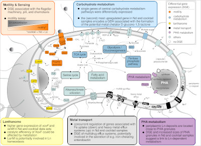
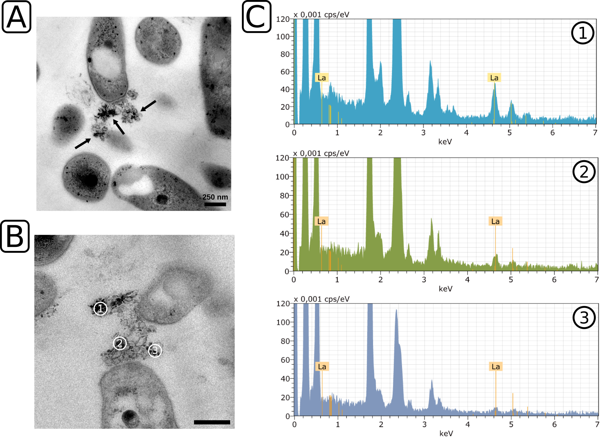

title: About me.
author: Carl-Eric Wegner
date: 2023-10-03
slug: index
save_as: index.html
status: hidden

Hi! My name is Carl-Eric Wegner and I'm lecturer at the [Friedrich Schiller University Jena](https:///www.uni-jena.de) and PI in the lab of [Kirsten Küsel](https://www.bio.uni-jena.de/en/kuesellab). 

I'm a trained microbiologist with a background in applied biology, molecular/environmental microbiology, and bioinformatics. I'm driven by my interest in **microbial physiology** - how do microbes contribute to planetary health and how can we potentially use them to make our life more sustainable.

The work of my project group is centered around **lanthanide-dependent metabolism**. My broader research interests include **top-down / bottom-up microbial carbon cycling**, **subsurface microbiology**, and **metal cycling**.  For our work we follow an _embedded omics_ approach, combining DNA sequencing-based methods with complementary methods to tackle research objectives from different angles.  

I'm affiliated with the collaborative research center [ _AquaDiva_ ](http://www.aquadiva.uni-jena.de/), the excellence cluster [ _Balance of the  Microverse_ ](https://www.microverse-cluster.de/en/), and PI in the collaborative research center [ _ChemBioSys_ ](https://chembiosys.de/en/).

Looking for new challenges is part of my understanding of research and science. Feel free to reach out to <i class="fa fa-envelope-open" aria-hidden="true"></i> [_carl-eric.wegner@uni-jena.de_](mailto:carl-eric.wegner@uni-jena.de) if you want to get in touch!

___

##Selected publications.

<table class="tg">
<thead>
  <tr>
    <th class="tg-0lax" style="width:30%">
<a href="https://www.biorxiv.org/content/10.1101/2023.03.06.530795v1" style="border:none !important;">
</th>
    <th class="tg-73oq" rowspan="2">Beijerinckiaceae bacterium RH AL1 only grows with methanol in the presence of light lanthanides (Ln) (La, Ce, Nd). Incubations showed little differences in growth dependent on supplementation with either La, Nd, or a Ln cocktail (Ce, Nd, Dy, Ho, Er, Yb). Transcriptomics from these incubations revealed differential expression for up to ~40% of the encoded genes. We could show and confirm my belief that Ln potentially reach into many aspects of physiology. Using advanced microscopy, we also collected additional evidence that strain RH AL1 distinguishes and selectively takes up Ln into the periplasm. Periplasmic deposition might function as mechanism to maintain intracellular Ln homeostasis. There are no comparable studies from other organisms used to investigate Ln-dependent physiology. Strain RH AL1 provides novel insights into lanthanide-dependent physiology, and starting points for biology-inspired applications. <i class="fa fa-hand-o-right" aria-hidden="true"></i> <a href="https://www.biorxiv.org/content/10.1101/2023.03.06.530795v1"><b>LINK TO PAPER</b></a></th>
  </tr>
  <tr>
    <th class="tg-0lax">Microbiology Spectrum (2023) <i>accepted</i> Gorniak et al. | Different lanthanide elements induce strong gene expression changes in a lanthanide-accumulating methylotroph</th>
  </tr>
</thead>
<tbody>
  <tr>
    <td class="tg-0lax">
<a href="https://doi.org/10.1186/s40168-023-01647-2" style="border:none !important;">
</td>
    <th class="tg-73oq" rowspan="2">Subsurface microbiomes, making up a substantial portion of global microbial biomass, are mostly studied by looking at groundwater. However, subsurface microbial biomass is to a large extent made up by attached and endolithic microbes. Methods from paleogenomics have been adapted and applied to rock material from depths down to 293 meters below ground level. Endolithic metagenomic DNA was extracted and subjected to taxonomic and functional profiling, as well as DNA damage analysis. DNA damage patterns allowed distinguishing between potentially alive cells and paleomes, genetic signatures of past microbial communities. Comparable work has not been done for subsurface rock habitats. In conjunction with adequate dating this approach will open the door to studying the geomicrobiological history of the subsurface. <i class="fa fa-hand-o-right" aria-hidden="true"></i> <a href="https://doi.org/10.1186/s40168-023-01647-2"><b>LINK TO PAPER</b></a></th>
  </tr>
  <tr>
    <td class="tg-0lax">Microbiome Wegner et al. (2023) | A glimpse of the paleome in endolithic microbial communities</td>
  </tr>
  <tr>
    <th class="tg-0lax">
<a href="https://dx.doi.org/10.1128/AEM.03144-20" style="border:none !important;">
</th>
    <th class="tg-73oq" rowspan="2">Methylorubrum extorquens AM1 is the de facto model for Ln-dependent metabolism and accumulates Ln in the cytoplasm. After establishing Beijerinckiaceae bacterium RH AL1 as additional model (Wegner et al., 2020), we used advanced electron microscopy and showed that strain RH AL1 accumulates Ln extracellularly using outer-membrane vesicles, intracellularly in the periplasm, and at significantly lower concentrations than AM1. High-resolution elemental analysis provided first evidence for selective Ln uptake (see Gorniak et al., 2023 above). The latter two aspects make RH AL1 interesting for potential biorecovery strategies regarding Ln. Growth assays and transcriptomics showed that Ln have a positive effect on growth in strain RH AL1 independent of methylotrophy, which was a first and has not been described for other commonly studied bacteria in the context of Ln-dependent metabolism. <i class="fa fa-hand-o-right" aria-hidden="true"></i> <a href="https://dx.doi.org/10.1128/AEM.03144-20"><b>LINK TO PAPER</b></a></th>
  </tr>
  <tr>
    <th class="tg-0lax">Appl. Environ. Microbiol. Wegner et al. (2021) | Extracellular and intracellular lanthanide accumulation in the methylotroph Beijerinckiaceae bacterium RH AL1</th>
  </tr>
</tbody>
</table>

___

###CV - selected highlights.

* **_>35 peer-reviewed publications_** incl. _Microbiome_, _ISME Journal_, _Science of The total Environment_

* **_h-index 18_**, **_i-index 23_**, **_peer-reviewer for numerous journals_** incl. _Nature (Communications)_, _ISME Journal/Communications_

* **_>700k € acquired third-party funding_** 

* **_broad, well-evaluated teaching portfolio_** 

* **_former scholarship holder of the Max Planck Society_**

* **_awarded by the Federal State of Northrhine Westphalia for exceptional public service_**

<strong>[FULL CV](images/wegnerce_detailed_eng.pdf)</strong>

