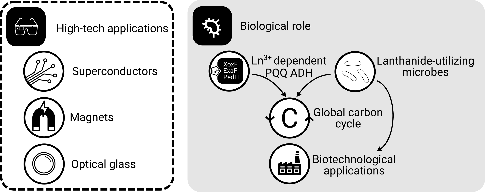
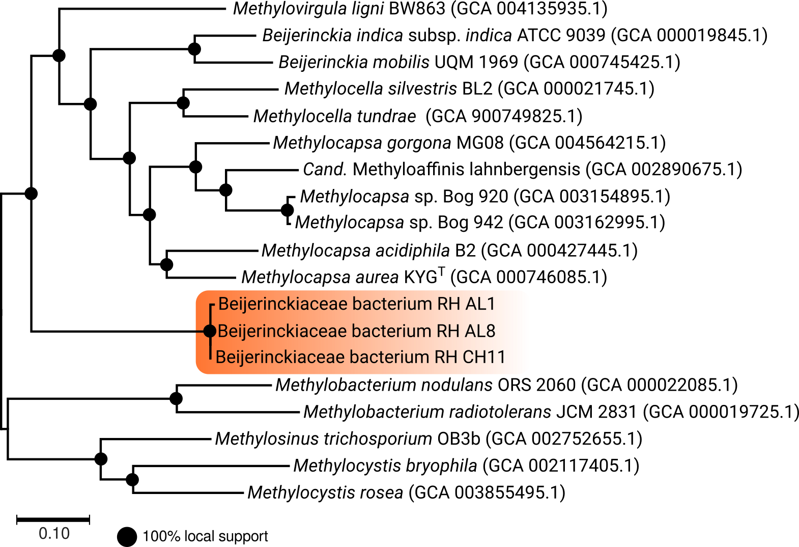
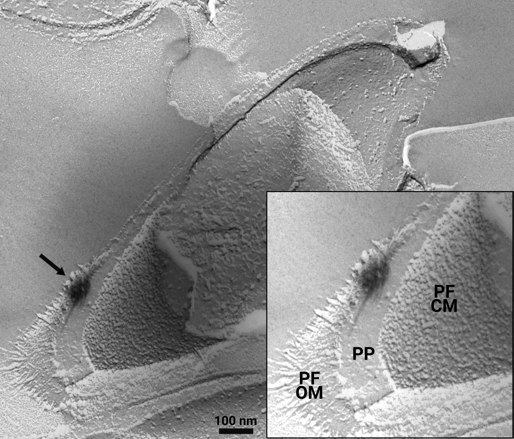
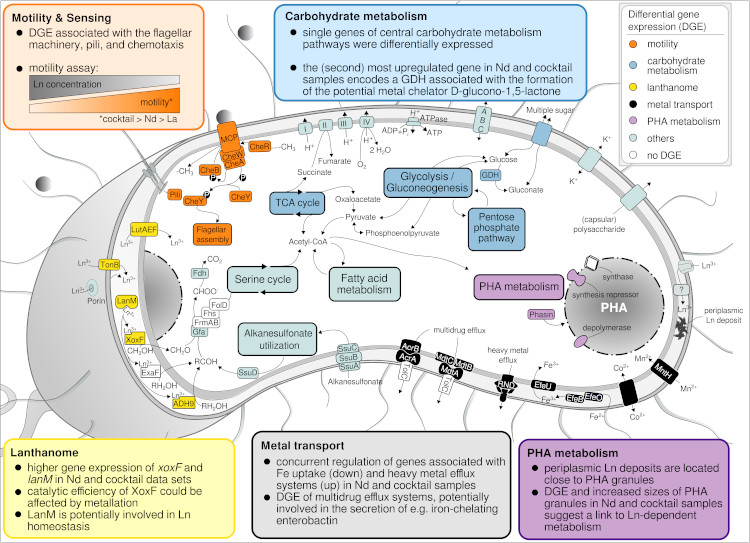
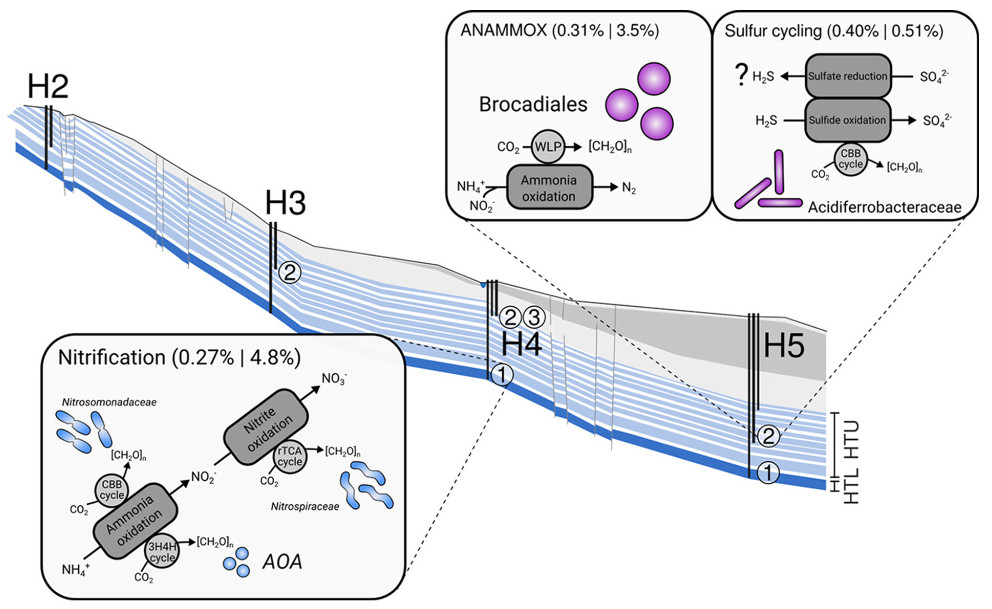
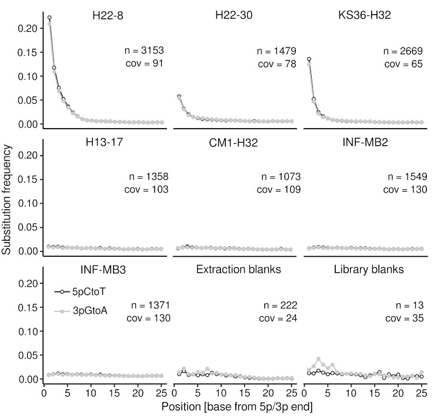
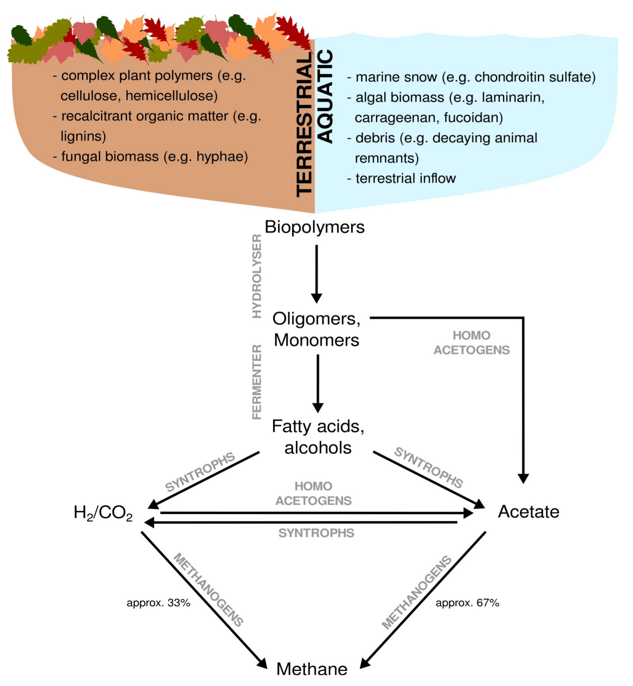

title: Research.
author: Carl-Eric Wegner
date: 2021-05-20
slug: research

##Lanthanide utilization in bacteria
What comes to your mind when you think about lanthanides aka rare earth elements? We all carry them around in our smartphones, and you might know that industry needs them for numerous high-tech products including optical glas, superconductors, and batteries (**Figure 1**). Maybe you also know that China produces most of them - demands are high and global production is limited.

While it was hypothesized for years that lanthanides would be powerful enzymatic co-factors due to their strong Lewis acidity, lanthanide-dependent enzymes were only discovered a few years ago in methylotrophic bacteria (bacteria that utilize organic compounds without carbon-carbon bonds as energy and carbon source). Lanthanides are the most recently described life metals. The relevance of lanthanides goes beyond microbiology as positive effects of lanthanides on crop growing and livestock are known for a long time, while the underlying mechanisms are not understood.

In methylotrophic bacteria, lanthanides function as co-factors in methanol dehydrogenase, the key enzyme of methanol oxidation. Taking into account the ecological role of methylotrophs, lanthanides are of high relevance with respect to microbial carbon cycling.

<small><b>Figure 1: <i>The roles of lanthanides.</i></b> Lanthanides are needed for many high-tech applications. In the context of microbiology, lanthanides are primarily known from methylotrophic bacteria, which need them as enzymatic co-factors for methanol oxidation - a process highly relevant for global carbon cycling. The ability to solubilize lanthanides makes methylotrophs an attractive target for the biologically mediated recovery of lanthanides. </small>

The ability of certain methylotrophic taxa to solubilize lanthanides might facilitate the development of bio-inspired methods to recover and recycle these valuable metals for instance by coupling lanthanide enrichment to the consumption of waste and inexpensive feedstocks such as methane and methanol. In that sense, understanding lanthanide utilization better can contribute to a more sustainable economy, especially regarding the ongoing decarbonisation and green-energy transition.

###Motivation & selected findings
Research dedicated to lanthanide-dependent metabolism is severely limited to few model organisms that do not represent the taxonomic and expected functional diversity of microbes utilizing lanthanides. I'm working on establishing a new, lanthanide-dependent methylotroph of the family Beijerinckiaceae, strain AL1 (**Figure 2**), as platform to win a more comprehensive understanding about lanthanide-dependent metabolism (Wegner et al., 2020; 	Wegner et al., 2021). Strain AL1 was isolated from soft coal slags enriched in lanthanides (Wegner and Liesack, 2017) and in comparison to methylotrophic model organisms it only posseses lanthanide-dependent methanol dehydrogenases and multiple other lanthanide-dependent enzymes with unknown substrate spectra. We could show periplasmic storage of lanthanides in strain AL1, something that was so far not seen in other methylotrophs (**Figure 3**). 

<small><b>Figure 2: <i>A phylogenomic tree of the family Beijerinckiaceae.</i></b> Phylogenomic analyses of Beijerinckiaceae strains isolated from early-industrial soft coal slags was done based on sequenced genomes and available genomes of related family members using a set of genes representing the core genome of the family Beijerinckiaceae. Phylogenomics revealed a distinct grouping of the isolated strains, and calculated percentages of conserved proteins revealed that the isolated strains constitute a new genus-level group (modified based on Wegner et al., 2020). </small>

<small><b>Figure 3: <i>Freeze-fracture TEM image of strain AL1.</i></b> Growing strain AL1 at 1 and 10 µM revealed extracellular storage of lanthanides attached to outer membrane vesicle-like material. A closer look with freeze-fracture TEM also identified intracellular storage in the periplasm. The black arrow indicates an intracellular lanthanum deposit. PF = protoplasmic fracture face, CM = cytoplasmic membrane, OM = outer membrane, PP = periplasm (modified based on Wegner et al., 2021).  </small>

Based on advanced electron microscopy, RNAseq-based gene expression analysis, and high-resolution elemental analysis, we have increasing evidence that Beijerinckiaceae bacterium RH AL1 can sense, distinguish, and selectively take up and store lanthanides. Changes in lanthanide supplementation reach into many metabolic aspects in strain RH AL1 - way beyond methylotrophy (Gornial et al., 2023) (**Figure 4**).

<small><b>Figure 4: <i>Metabolic aspects responding to differences in La concentration and added Ln elements in Beijerinckiaceae bacterium RH AL1 when grown with methanol as the carbon source.</i></b> The color code of the text boxes refers to individual metabolic aspects. Colored proteins in the cell scheme highlight the differential expression of the genes encoding the corresponding protein. DGE = differential gene expression, GDH = glucose dehydrogenase (taken from Gorniak et al., 2021). </small>

###Publications
+ Gorniak L, Bechwar JA, Westermann M, Steiniger F, **Wegner CE** (2023) Different lanthanide elements induce strong gene expression changes in a lanthanide-accumulating methylotroph. _Microbiology Spectrum_ _(accepted)_ [doi: 10.1101/2023.03.06.530795v1](https://www.biorxiv.org/content/10.1101/2023.03.06.530795v1)

+ **Wegner CE**, M Westermann, F Steiniger, L Gorniak, R Budhraja, L Adrian, K Küsel (2021). Extracellular and intracellular lanthanide accumulation in the methylotroph Beijerinckiaceae bacterium RH AL1. _Appl. Environ. Microbiol._ 87: e03144-20. [10.1128/AEM.03144-20](https:/doi.org/10.1128/AEM.03144-20)

+ **Wegner CE**, Gorniak L, Riedel S, Westermann M, Küsel K (2020) Lanthanide-Dependent Methylotrophs of the Family Beijerinckiaceae: Physiological and Genomic Insights. _Appl. Environ. Microbiol._ 86: e01830-19 [doi:10.1128/AEM.01830-19](https://doi.org/10.1128/AEM.01830-19)

+ **Wegner CE**,  Liesack W (2017) Unexpected dominance of elusive Acidobacteria in early industrial soft coal slags. _Front. Microbiol._ 8:1023 [doi: 10.3389/fmicb.2017.01023](http://dx.doi.org/10.3389/fmicb.2017.01023)

___

##Subsurface microbiology
One aspect of subsurface microbiology is to understand microbial surface-subsurface links in the Earth’s Critical Zone (CZ). The CZ is defined as the Earth’s near-surface layer ranging from the vegetation canopy down to saturated and unsaturated bedrock, including the pedosphere and aquifers. Groundwater is a keyhole to study the subsurface, it is an essential resource for drinking water and irrigation. The interplay between geological setting, hydrochemistry, carbon storage, and groundwater microbiome functioning is crucial for our understanding of these important ecosystem services.

###Motivation and selected findings
What are facors that control groundwater microbiomes, how are groundwater microbiomes formed? Through metagenomics and -transcriptomics, we could show that groundwater microbiomes are mainly driven by nitrogen- and to a lesser extent sulfur cycling, depending on local hydrochemical differences between groundwater wells (**Figure 5**) (Wegner et al., 2019). Surprisingly, we also noted a constitutive expression of carbohydrate-active enzymes along the groundwater flowpath, suggesting that organic carbon turnover complements lithoautotrophic carbon assimilation pathways.

<small><b>Figure 5: <i>Microbial community functions along the Hainich CZE aquifer assemblages.</i></b> Microbial metabolism is dominated dominated by chemolithoautotrophic processes. Values in parentheses refer to summed relative abundances of gene functions linked to the respective processes (e.g., nitrification) on the metagenome and metatranscriptome levels. WLP, Wood-Ljungdahl pathway; CBB, Calvin-Benson-Bassham; rTCA, reductive tricarboxylic acid; 3H4H, 3-hydroxypropionate/4-hydroxybutyrate; [CH2O]n, biomass; AOA, ammonia-oxidizing archaea; H2-H5,position of wells along the monitoring transect; numbers in circles, different wells accessing the aquifer assemblages (modified based on Wegner et al., 2019). </small>

Microbial community functions along the Hainich CZE aquifer assemblages are dominated by chemolithoautotrophic processes. H2-H5 = position of wells along the monitoring transect, numbers in circles = different wells accessing the aquifer assemblages. Modified based on

We studied the formation of a groundwater microbiome, by tracing the input of microorganisms from recharge areas into fractured aquifers focusing on the ultra-small and potentially symbiotic Cand. Patescibacteria, which are part of the “candidate phyla radiation” (CPR) and often abundant in groundwater (Herrmann et al., 2019). Co-occurence network analysis revealed a central role for Cand. Patescibacteria in groundwater microbial communities and links to chemolithoautotrophic taxa involved in iron-, sulfur- and nitrogen-cycling. Apparently, import from soil, and community differentiation driven by hydrochemical conditions (Figure 2), including the availability of organic resources and potential partner microorganisms, determine Cand. Patescibacteria success in groundwater.

Our understanding about terrestrial subsurface microbiomes is almost exclusively derived from groundwater and porous sediments. Subsurface biomass estimates are flawed by uncertainties due to poorly understood parameters such as the ratio between surface-attached and endolithic to pelagic groundwater cells, for which assumptions range between 10000 and 1. By adapting methods from microbial archaeology and paleogenomics, we were able to successfully recover genomic DNA from rock cores originating from limestone and mudstone from the vadose zone, and deep aquitards (down to 293 meters below ground level) (Wegner et al., 2023). DNA damage pattern analysis, for the first time carried out for subsurface and endolithic rock material, revealed paleome signatures (genetic records of past microbial communities) for three rock specimen (H22-8, H22-30, KS36-H32, **Figure 6**). Taxonomic and functional profiling suggested a high relevance of chemolithoautotrophy for endolithic microbiomes, but also the utilization of sedimentary organic carbon in the past. We propose that limestones can function as archives for genetic records of past microbial communities, due to their specific conditions facilitating  long‑term DNA preservation.

<small><b>Figure 6: <i>DNA damage pattern analysis.</i></b> The plots show the substitution frequency (5pCtoT [5’ cytosine to thymine substitutions],  3pGtoA [3’ guanine to adenine substitutions]) versus the relative position (from the 5p and 3p end). n, number of contigs >   1 kbp considered for the analysis; cov, mean coverage of the contigs (Taken from Wegner et al., 2023). </small>

###Publications

+ **Wegner CE**, Stahl R, Velsko I, Hübner A, Fagernäs Z, Warinner C, Lehmann R, Ritschel T, Totsche KU, Küsel K (2023) A glimpse of the paleome in endolithic microbial communities. _Microbiome_ 11:210 [doi: 10.1186/s40168-023-01647-2](https://doi.org/10.1186/s40168-023-01647-2)

+ Geesink P, **Wegner CE**, Probst AJ, Herrmann M, Dam HT, Kastner AK, Küsel K (2020) Genome‐inferred spatio‐temporal resolution of an uncultivated Roizmanbacterium reveals its ecological preferences in groundwater. _Environ. Microbiol._ 22:726-737 [doi:10.1111/1462-2920.14865](https://doi.org/10.1111/1462-2920.14865)

+ Herrmann M, **Wegner CE**, Taubert M, Geesink P, Lehmann K, Yan L, Lehmann R, Totsche KU, Küsel K (2019) Predominance of Cand. Patescibacteria in Groundwater Is Caused by Their Preferential Mobilization From Soils and Flourishing Under Oligotrophic Conditions. _Front. Microbiol._ 10:1407 [doi: 10.3389/fmicb.2019.01407](https://doi.org/10.3389/fmicb.2019.01407)

+ **Wegner CE**, Gaspar M, Geesink P, Herrmann M, Marz M, Küsel K (2019) Biogeochemical regimes in shallow aquifers reflect the metabolic coupling of the elements nitrogen, sulfur and carbon. _Appl. Environ. Microbiol._ 85:e2346-18 [doi: 10.1128/AEM.02346-18](https://doi.org/10.1128/AEM.02346-18)
___

##Complex organic matter breakdown and carbon cycling in wetlands

Methane is a major driver of global climate change and it is a product of anaerobic organic matter breakdown. A significant proportion of anthropogenic methane is emitted from (artificial) wetlands, including rice paddies. Microbes in wetlands are commonly exposed to recalcitrant organic carbon in form of complex polysaccharides and lignins. Methane emissions from wetlands are rate-limited by the breakdown of these carbon sources (Figure 4). The enzymatic toolkit needed for breaking down these carbon sources and the microbes possessing them are highly diverse.

Considering the ongoing advance of global climate change, methane emissions from wetlands are expected to increase as so far buried organic carbon becomes more prone to breakdown. The only known sink of atmospheric methane and C1 compounds contributing to methane emissions are methanotrophic/methylotrophic prokaryotes, which makes them a prime target to learn more about natural mechanisms of methane mitigation.

<small><b>Figure 4: <i>Anaerobic breakdown of complex organic matter by methanogenic communities.</i></b> Dependent on the environment, terrestrial versus aquatic, complex organic matter originates from different sources. Complex organic matter is almost exclusively a result of biomass assimilation. Except for methanogenesis, all breakdown steps can occur under oxic and anoxic conditions. Fermenting organisms hydrolyse and ferment biopolymers to primary and secondary fermentation products,which are subsequently syntrophically converted to H2/CO2 and acetate. Acetate and H2/CO2 represent the two major substrate pools for methanogenesis.</small>

###Motivation
Past and ongoing research of mine is driven by the goal of learning more about complex carbon turnover in artificial and natural wetlands. A more recent aspect of this research is the effect of environmental stress (salt stress, draught) on complex organic carbon turnover. Moreover, I'm interested in methylotrophs/methanotrophs from environments exposed to naturally high methane concentrations (e.g. the surrounding of methane seeps, Figure 5), and extreme environments in general to learn more about underlying mechanisms of C1 carbon turnover.

<small><b>Figure 5: <i>Terrestrial methane seepage.</i></b> Geological methane originates from sources including coal beds and gas deposits. Methane reservoirs are usually trapped under compacted layers of rock. A release into the atmosphere is possible through small cracks, which arise, for instance, through the retreat of glaciers and thawing permafrost. Methane seeps are diverse, and among other structures, include small gas vents (microseeps) and mud volcanoes (macroseeps).</small>

###Publications

+ Wu X, Liu P, **Wegner CE**, Luo Y, Xiao K-Q, Cui Z, Zhang F, Liesack W, Peng J (2021) Deciphering microbial mechanism underlying soil organic carbon storage in a wheat maize rotation system. _Sci. Total Environ._ _(accepted)_ [10.1016/j.scitotenv.2021.147798](https://doi.org/10.1016/j.scitotenv.2021.147798)

+ Abdallah RZ, **Wegner CE**, Liesack W (2019) Community transcriptomics reveals drainage effects on paddy soil microbiome across all three domains of life. _Soil Biol. Biochem._ 132:131-142 [doi: doi.org/10.1016/j.soilbio.2019.01.023](https://www.sciencedirect.com/science/article/abs/pii/S0038071719300318)

+ Peng J, **Wegner CE**, Bei Q, Liu P, Liesack W (2018) Metatranscriptomics reveals a different temperature effect on the structural and functional organization of the anaerobic food web in rice field soil. _Microbiome_ 6:169 [doi: 10.1186/s40168-018-0546-9](https://doi.org/10.1186/s40168-018-0546-9)

+ Peng J, **Wegner CE**,  Liesack W (2017) Short-term exposure of paddy soil microbial communities to salt stress triggers different transcriptional responses of key taxonomic groups. _Front. Microbiol._ 8:400 [doi: 10.3389/fmicb.2017.00400](http://dx.doi.org/10.3389/fmicb.2017.00400)

+ Ivanova AA, **Wegner CE**, Kim Y, Liesack W, Dedysh SN (2016) Identification of microbial populations driving biopolymer degradation in acidic peatlands by metatranscriptomic analysis. _Mol. Ecol._ 19:4818-4835 [doi: 10.1111/mec.13806](http://dx.doi.org/10.1111/mec.13806)

+ **Wegner CE**, Liesack W (2016) Microbial community dynamics during the early stages of plant polymer breakdown in paddy soil. _Environ. Microbiol._ 18: 2825-2842 [doi: 10.1111/1462-2920.12815](http://dx.doi.org/10.1111/1462-2920.12815)

+ Oshkin IY, **Wegner CE**, Lüke C, Glagolev MV, Filippov IV, Pimenov NV, Liesack W, Dedysh SN (2014) Gammaproteobacterial methanotrophs dominate cold methane seeps in floodplains of Western Siberian Rivers. _Appl. Environ. Microbiol._ 80: 5944-5954 [doi: 10.1128/AEM.01539-14](http://dx.doi.org/10.1128/AEM.01539-14)
