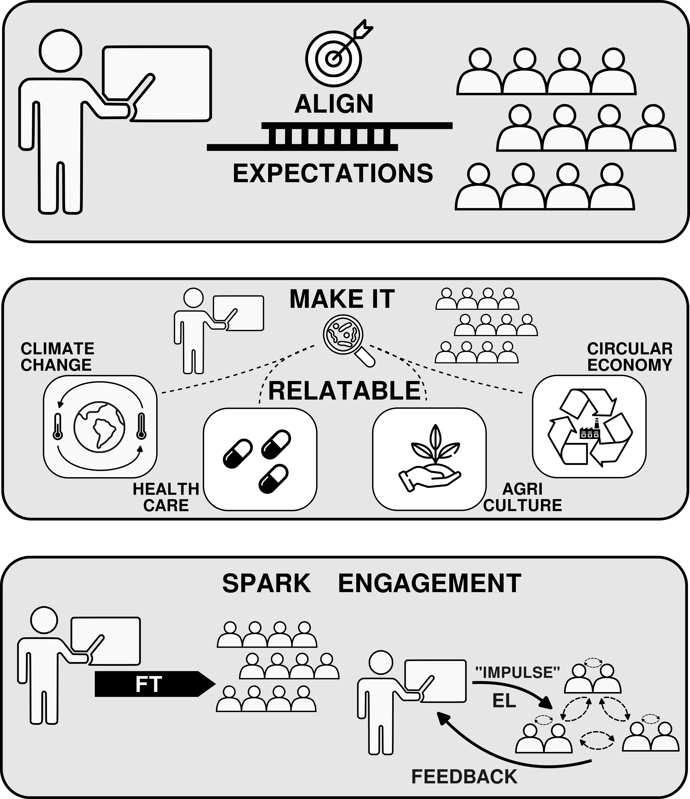

title: Teaching.
author: Carl-Eric Wegner
date: 2020-09-29
slug: teaching

Besides from doing research, I'm working as lecturer at the FSU Jena. Currently, I'm teaching classes in: _general microbial_, _(molecular) microbial ecology_ and _bioinformatics_. 

##Classes

###Winter term
####Study program | Module | Class
- MSc. Biogeosciences, MSc. Microbiology | MBGW1.4 | Current topics in Geomicrobiology | Seminar
- BSc. Biogeosciences, BSc. Nutrition Science | BBGW3.6, BEW003 | Microbiology | Lecture

###Summer term
- MSc. Biogeosciences, MSc. Microbiology | MBGW2.2.3 | Molecular Microbial Ecology | Seminar
- MSc. Biogeosciences, MSc. Microbiology | MBGW2.2.3 | Molecular Microbial Ecology | Practical course
- BSc. Biogeosciences | BBGW3.6 | Microbiology | Practical course

Details about the different modules can be found in [_Friedolin_](https://friedolin.uni-jena.de/qisserver/rds?state=user&type=0), we generally use [_Moodle_](https://moodle.uni-jena.de/) as online platform to provide materials etc..

###Theses and profile modules
You had a look at my research and you are interested in doing a profile module, lab rotation or your thesis with me? Contact me via [**_ e-mail _**](mailto:carl-eric.wegner@uni-jena.de) or drop by my office and we can talk about potential topics and details.

##Teaching philosophy

I aim at giving students the tools/knowledge that allow them to learn on their own, I want them to understand that microbiology is a multifaceted discipline and that you have to look at it from many different angles. As a supervisor I believe in two principles: (1) "Failure is an option. There is not learning without making mistakes." (2) "I do, we do, you do". My teaching philosophy rests on three concepts:

1. **Align expectations** 
2. **Make it relatable**
3. **Spark engagement**

**_Align expectations:_** Successful teaching and supervision, or more generally any project/teamwork, are rooted in aligned expectations. Key questions are: i) what are the learning objectives, ii) how are they achieved, iii) how is progress measured, iv) why are they relevant? In any class, it is key to know your target audience,  assess and acknowledge their previous knowledge, and give them the opportunity to voice their expectations. The concept of “SMART” (specific, measurable, achievable, relevant, time-bound) goals equally applies to teaching as it does to leadership and project management, but also SMART goals are only sustainable if students and teachers know and stick to the rules of the game.

**_Make it relatable:_** University teaching has the tendency to foster extrinsic motivation. “We have to learn X and pass exam Y to reach goal Z.” This is hard to avoid, and a portion of students in any random class will always feel this way. Good teaching aims at sparking intrinsic motivation to learn. My personal belief is that intrinsic motivation for learning is tightly linked to seeing the greater picture - “what is it all good for”. To see the greater picture, it is essential to lift the curtain and show how the contents of classes touch aspects of the daily life of each and everyone of us.

**_Spark engagement:_** Depending on the class format (imagine big lecture vs small seminar), “frontal teaching” (FT) is a given, at least to a certain extent. Nonetheless, breaking the habit of holding a monologue, opens the opportunity to more meaningful teaching, and more engaged/committed students. While FT definitely serves a purpose, and contents presented this way are well-remembered in the short term, engaged learning (EL) has more long-lasting effects, and contents taught this way are better retained. 

